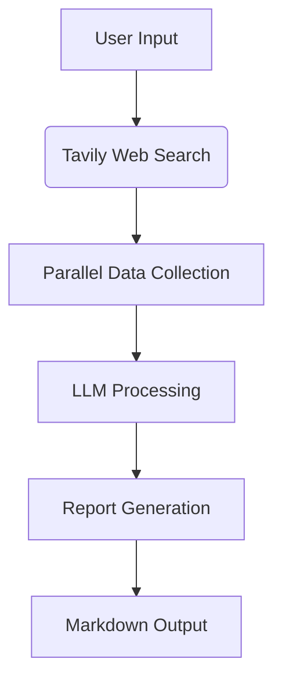

# Company Research Agent

## Overview
This Python tool leverages the power of large language models [LLaMA-3-8B](https://huggingface.co/McGill-NLP/Llama-3-8B-Web) and Tavily web search API to generate comprehensive company research reports. The agent automatically gathers information from multiple sources, synthesizes the data, and produces a professional Markdown report covering key business aspects of any company.


## Key Features
- **Comprehensive Research**: Covers 7 critical business dimensions
- **Source Verification**: Includes all sources with confidence scoring
- **Efficient Processing**: Parallel search execution
- **Professional Output**: Ready-to-use Markdown report
- **Optimized Performance**: 4-bit quantization for GPU efficiency

## Prerequisites
- Python 3.8+
- Tavily API key (free at [app.tavily.com](https://app.tavily.com))
- NVIDIA GPU with CUDA support (recommended)
- 16GB+ RAM

## Installation
1. Clone the repository:
```bash
git clone https://github.com/darkangrycoder/company-research-agent.git
cd company-research-agent
```

2. Install required dependencies:
```bash
pip install -r requirements.txt
```

## Configuration
1. Get your Tavily API key from [app.tavily.com](https://app.tavily.com)
2. Open `comp_research_agent.py` in a text editor
3. Locate the API key section and insert your key:
```python
# Get Tavily API key securely
TAVILY_API_KEY = "your_api_key_here"  # ← Replace with your actual key
tavily = TavilyClient(api_key=TAVILY_API_KEY)
```

## Usage
Run the research agent with the company name as an argument:
```bash
python comp_research_agent.py --company "Company Name"
```

Example:
```bash
python comp_research_agent.py --company "Tesla"
```

## Execution Notes
1. **GPU Requirement**: For optimal performance, run on GPU-enabled environment
   - Google Colab: Use "Runtime > Change runtime type > GPU"
   - Local: Ensure CUDA drivers are installed
2. **Processing Time**: Typically 3-6 minutes per report
3. **Output**:
   - Report printed in console
   - Markdown file saved as `{Company_Name}_report.md`

## Report Sections
Each comprehensive report includes:
1. **Overview**: Founding, leadership, milestones
2. **Financials**: Revenue, funding, reports
3. **Operations**: Employees, locations
4. **Market**: Competitors, market share
5. **Digital**: Social media presence
6. **Recent News**: Latest developments
7. **Employer**: Company culture, ratings
8. **All Sources**: Complete reference list

## Technical Architecture


## Optimization Features
- **4-bit Quantization**: Reduces model memory requirements by 4x
- **Async I/O**: Parallel web searches for faster data collection
- **Content Truncation**: Focuses on most relevant information
- **HTML Sanitization**: Clean text processing for better LLM comprehension

## Troubleshooting
**Common Issues:**
- **Slow Performance**: Ensure you're using GPU acceleration
- **API Errors**: Verify Tavily API key is valid and has sufficient credits
- **Incomplete Reports**: Check network connection and API limits

**Error Messages:**
- `TavilyAPIError`: Invalid or expired API key
- `CUDA Out of Memory`: Reduce model size or use larger GPU
- `ConnectionError`: Check internet connection

## Limitations
- Requires stable internet connection
- Tavily API has daily request limits
- Accuracy depends on web source reliability
- Complex company structures may require manual verification

## Future Enhancements
- [ ] Multi-company comparison reports
- [ ] PDF export option
- [ ] Historical trend analysis
- [ ] Automated source credibility scoring
- [ ] Custom report templates

---

**Get your Tavily API key:** [app.tavily.com](https://app.tavily.com)  
**Llama 3.8 Web Model**[https://huggingface.co/McGill-NLP/Llama-3-8B-Web](https://huggingface.co/McGill-NLP/Llama-3-8B-Web)
**Report Issues:** [GitHub Issues](https://github.com/darkangrycoder/company-research-agent/issues)  
**Contribute:** Fork and submit pull requests
